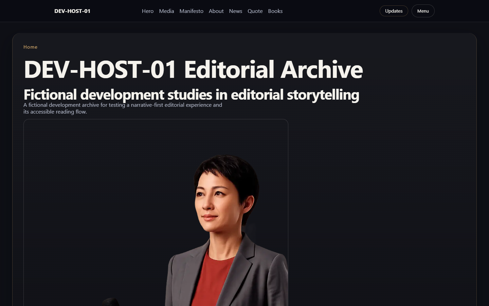

# Editorial WebGL Portfolio

A DOM-first editorial portfolio built with Next.js, TypeScript, and a
single-canvas Three.js runtime for responsive, scroll-driven storytelling.

The project keeps semantic content and accessible fallbacks in the DOM while
Hero, Media, About, and Books scenes share one Canvas, one WebGL renderer, one
camera, and one animation loop.

## Architecture

- DOM-first content, SEO, accessibility, and fallback layers
- one global Canvas and `THREE.WebGLRenderer`
- one camera owned by `CameraRig`
- one RAF owned by `FrameCoordinator`
- scene lifecycle and camera-intent arbitration through `SceneDirector`
- native Three.js runtime; no R3F runtime path
- responsive desktop/mobile assets and reduced-motion behavior

Current release status: RC-03B sign-off preparation. P4-01 Hero, P4-02 Media,
P4-03 About, P4-04 Books, RC-01, RC-02, and RC-03A are closed. The project is
still a noindex demonstration RC; formal production identity, asset rights,
domain, and operating ownership remain open.

## Demo

https://github.com/user-attachments/assets/9cf7d8f6-c6c7-4477-93a8-2e4e6fd102af

[Watch the 1440 x 900 local production-preview recording](docs/demo/editorial-webgl-demo.webm).
The demo is a fictional development experiment using development imagery; it
does not represent a real person, publisher, ticketing, purchasing, or
commercial service.

## Requirements

- Node.js 22 or later
- pnpm 11

## Commands

- `pnpm install` — install dependencies
- `pnpm dev` — start the local development server
- `pnpm lint` — run ESLint
- `pnpm typecheck` — check TypeScript
- `pnpm test` — run unit tests
- `pnpm test:e2e` — run Playwright browser tests
- `pnpm build` — create a production build

## Project notes

Architecture decisions, rendering contracts, implementation plans, and the
current phase handoff are stored under `docs/`. Packaged portrait and cover
assets are development placeholders and are not production identity assets.
DEV-HOST-01 is fictional; its timeline and the three FIELD NOTES books are
concept content. This project provides no real purchasing, ticketing,
publishing, awards, or person-related commercial service.
